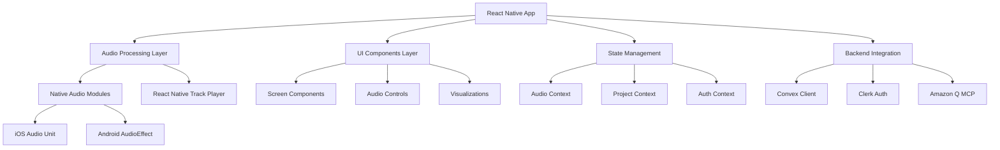

# Design Document

## Overview

The Master Blaster React Native Mobile App will be built using React Native CLI with a focus on native audio processing performance. The architecture leverages React Native Track Player for audio playback, custom native modules for real-time audio processing (EQ and compression), and maintains integration with the existing Convex backend and Clerk authentication system. The design prioritizes performance, user experience, and cross-platform compatibility while providing professional-grade audio processing capabilities.

## Architecture

### High-Level Architecture



### Native Audio Processing Architecture

The app uses a dual-layer audio processing approach:
- **Playback Layer**: React Native Track Player handles audio file loading, playback, and transport controls
- **Processing Layer**: Custom native modules handle real-time EQ and compression processing

### Data Flow

1. **Audio Import**: File picker → Native file handling → Track Player setup
2. **Processing**: Audio buffer → Native processing modules → Real-time parameter updates
3. **Visualization**: Audio data → React Native SVG → Real-time waveform/spectrum display
4. **Export**: Processed audio → Native rendering → File system output

## Components and Interfaces

### Core Components

#### AudioProcessor (Native Module)
```typescript
interface AudioProcessor {
  // EQ Processing
  setEQEnabled(enabled: boolean): Promise<void>;
  setEQBand(band: number, frequency: number, gain: number, q: number): Promise<void>;
  getEQBand(band: number): Promise<EQBandData>;
  
  // Compression Processing
  setCompressorEnabled(enabled: boolean): Promise<void>;
  setCompressorParams(threshold: number, ratio: number, attack: number, release: number): Promise<void>;
  getCompressorMetrics(): Promise<CompressorMetrics>;
  
  // Audio Analysis
  getWaveformData(resolution: number): Promise<Float32Array>;
  getSpectrumData(): Promise<Float32Array>;
  getLevelMeters(): Promise<LevelMeterData>;
}
```

#### AudioPlayer Component
```typescript
interface AudioPlayerProps {
  source: AudioSource;
  onProgress: (progress: ProgressData) => void;
  onStateChange: (state: PlaybackState) => void;
  processingEnabled: boolean;
}

interface AudioPlayerState {
  isPlaying: boolean;
  position: number;
  duration: number;
  buffering: boolean;
}
```

#### EQControls Component
```typescript
interface EQControlsProps {
  bands: EQBand[];
  onBandChange: (band: number, params: EQBandParams) => void;
  presets: EQPreset[];
  onPresetLoad: (preset: EQPreset) => void;
  onPresetSave: (name: string) => void;
}

interface EQBand {
  frequency: number;
  gain: number;
  q: number;
  enabled: boolean;
}
```

#### WaveformVisualizer Component
```typescript
interface WaveformVisualizerProps {
  waveformData: Float32Array;
  progress: number;
  onSeek: (position: number) => void;
  zoomLevel: number;
  onZoomChange: (zoom: number) => void;
}
```

### Screen Components

#### MainEditorScreen
- Transport controls integration
- Waveform display with seek functionality
- Mode toggle (normal/EQ) with seamless switching
- Real-time parameter display

#### EQScreen
- 5-band parametric EQ interface
- Frequency response curve visualization
- Preset management
- Real-time parameter adjustment

#### CompressorScreen
- Threshold, ratio, attack, release controls
- Gain reduction meter
- Input/output level meters
- Compression curve visualization

## Data Models

### Project Model
```typescript
interface Project {
  id: string;
  name: string;
  userId: string;
  audioFileUrl: string;
  audioFileName: string;
  duration: number;
  sampleRate: number;
  eqSettings: EQSettings;
  compressorSettings: CompressorSettings;
  createdAt: Date;
  updatedAt: Date;
  thumbnail?: string;
}
```

### EQ Settings Model
```typescript
interface EQSettings {
  enabled: boolean;
  bands: [
    { frequency: 60, gain: 0, q: 0.7 },    // Low
    { frequency: 200, gain: 0, q: 0.7 },   // Low-Mid
    { frequency: 1000, gain: 0, q: 0.7 },  // Mid
    { frequency: 4000, gain: 0, q: 0.7 },  // High-Mid
    { frequency: 12000, gain: 0, q: 0.7 }  // High
  ];
  presetName?: string;
}
```

### Compressor Settings Model
```typescript
interface CompressorSettings {
  enabled: boolean;
  threshold: number;    // dB
  ratio: number;        // x:1
  attack: number;       // ms
  release: number;      // ms
  makeupGain: number;   // dB
}
```

### Audio Analysis Data Models
```typescript
interface LevelMeterData {
  inputLevel: number;
  outputLevel: number;
  gainReduction: number;
}

interface ProgressData {
  position: number;
  duration: number;
  bufferedPosition: number;
}
```

## Native Module Implementation

### iOS Implementation (Audio Units)
- Use AVAudioEngine for audio processing pipeline
- Implement custom Audio Units for EQ and compression
- Leverage Core Audio for low-latency processing
- Use Metal Performance Shaders for visualization data

### Android Implementation (AudioEffect API)
- Use Android AudioEffect API for EQ processing
- Implement custom native compression using C++
- Leverage OpenSL ES for low-latency audio
- Use RenderScript for visualization processing

### Cross-Platform Interface
```typescript
// Native module bridge
interface NativeAudioBridge {
  // Platform-agnostic methods
  initializeAudioEngine(sampleRate: number, bufferSize: number): Promise<void>;
  loadAudioFile(filePath: string): Promise<AudioFileInfo>;
  startProcessing(): Promise<void>;
  stopProcessing(): Promise<void>;
  
  // Event emitters for real-time data
  onLevelMeterUpdate: (data: LevelMeterData) => void;
  onWaveformDataReady: (data: Float32Array) => void;
  onProcessingError: (error: AudioProcessingError) => void;
}
```

## State Management

### Audio Context
```typescript
interface AudioContextState {
  // Playback state
  isPlaying: boolean;
  position: number;
  duration: number;
  
  // Processing state
  eqEnabled: boolean;
  compressorEnabled: boolean;
  eqSettings: EQSettings;
  compressorSettings: CompressorSettings;
  
  // Analysis data
  waveformData: Float32Array;
  levelMeters: LevelMeterData;
  
  // UI state
  zoomLevel: number;
  selectedMode: 'normal' | 'eq' | 'compressor';
}
```

### Project Context
```typescript
interface ProjectContextState {
  currentProject: Project | null;
  projects: Project[];
  isLoading: boolean;
  isDirty: boolean;
  autoSaveEnabled: boolean;
  lastSaved: Date | null;
}
```

## Error Handling

### Audio Processing Errors
- **Native Module Failures**: Fallback to bypass mode, display user-friendly error
- **File Loading Errors**: Validate file format, provide format conversion suggestions
- **Memory Issues**: Implement audio buffer management, reduce processing quality if needed
- **Platform-Specific Errors**: Handle iOS/Android differences gracefully

### Network and Storage Errors
- **Offline Mode**: Cache projects locally, sync when connection restored
- **Storage Full**: Implement cleanup utilities, warn users proactively
- **Convex Sync Errors**: Queue operations, retry with exponential backoff

### Error Recovery Strategies
```typescript
interface ErrorRecoveryStrategy {
  // Audio processing fallbacks
  enableBypassMode(): void;
  reduceProcessingQuality(): void;
  restartAudioEngine(): Promise<void>;
  
  // Data recovery
  recoverFromLocalStorage(): Promise<Project[]>;
  syncPendingChanges(): Promise<void>;
  
  // User communication
  showRecoveryOptions(error: AppError): void;
  logErrorForAnalytics(error: AppError): void;
}
```

## Testing Strategy

### Unit Testing
- Native module functionality testing
- Audio processing algorithm validation
- State management logic verification
- Utility function testing

### Integration Testing
- Audio pipeline end-to-end testing
- Convex backend integration testing
- Authentication flow testing
- File import/export testing

### Performance Testing
- Audio latency measurement
- Memory usage profiling
- CPU usage optimization
- Battery usage analysis

### Platform Testing
- iOS device compatibility testing
- Android device compatibility testing
- Different screen size adaptation
- Performance across device tiers

### User Experience Testing
- Gesture interaction testing
- Haptic feedback validation
- Accessibility compliance testing
- Offline functionality testing

## Performance Optimization

### Audio Processing Optimization
- Use native audio buffers for minimal latency
- Implement efficient parameter interpolation
- Optimize visualization data generation
- Cache processed audio segments when possible

### UI Performance
- Use React Native's new architecture (Fabric/TurboModules)
- Implement efficient list virtualization for project lists
- Optimize SVG rendering for waveform display
- Use native driver for animations

### Memory Management
- Implement audio buffer pooling
- Release unused audio resources promptly
- Monitor memory usage and implement warnings
- Use lazy loading for non-critical components

### Battery Optimization
- Pause processing when app is backgrounded
- Reduce visualization update frequency when not visible
- Implement efficient sleep/wake cycles
- Optimize network requests and caching