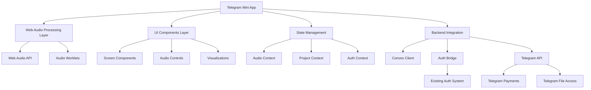
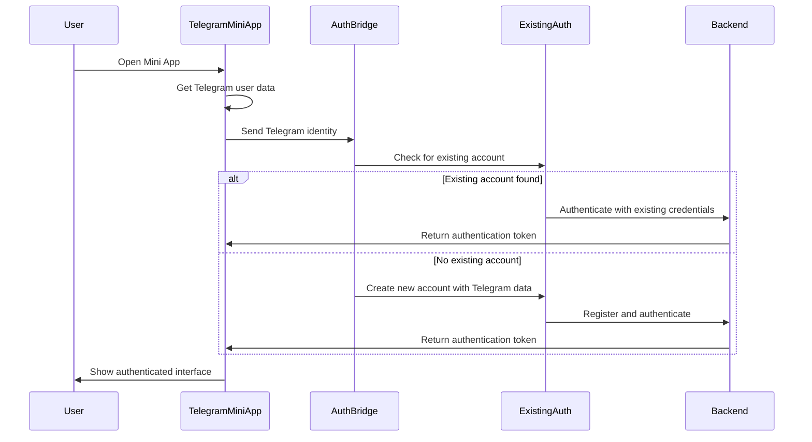
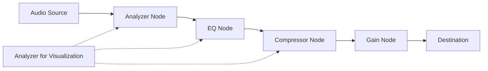

# Design Document

## Overview

The Master Blaster Telegram Mini App will be built by adapting the existing React-based web application to work within Telegram's Mini Apps platform. This design focuses on maximizing code reuse while adapting to Telegram's specific requirements and constraints. The architecture will leverage Web Audio API for audio processing, integrate with Telegram's identity and payment systems, and maintain compatibility with the existing backend services.

## Architecture

### High-Level Architecture



### Authentication Architecture

The authentication system will bridge Telegram's identity with the existing authentication system:



## Components and Interfaces

### Core Components

#### TelegramAuthBridge
```typescript
interface TelegramAuthBridge {
  // Initialize with Telegram user data
  initialize(telegramInitData: string): Promise<void>;
  
  // Connect to existing auth system
  connectToExistingAuth(): Promise<AuthResult>;
  
  // Check if user exists in our system
  checkExistingUser(telegramId: string): Promise<boolean>;
  
  // Create new user from Telegram data
  createUserFromTelegram(telegramUser: TelegramUser): Promise<User>;
  
  // Get authentication token
  getAuthToken(): string | null;
}
```

#### WebAudioProcessor
```typescript
interface WebAudioProcessor {
  // Initialize audio context
  initialize(sampleRate?: number): Promise<void>;
  
  // Load audio from various sources
  loadAudioFromUrl(url: string): Promise<AudioBuffer>;
  loadAudioFromFile(file: File): Promise<AudioBuffer>;
  loadAudioFromTelegram(fileId: string): Promise<AudioBuffer>;
  
  // EQ Processing
  setEQEnabled(enabled: boolean): void;
  setEQBand(band: number, frequency: number, gain: number): void;
  
  // Compression Processing
  setCompressorEnabled(enabled: boolean): void;
  setCompressorParams(threshold: number, ratio: number): void;
  
  // Playback control
  play(): void;
  pause(): void;
  seek(position: number): void;
  
  // Analysis and visualization
  getWaveformData(resolution: number): Float32Array;
  getSpectrumData(): Float32Array;
  getLevelMeters(): LevelMeterData;
}
```

#### TelegramUIAdapter
```typescript
interface TelegramUIAdapter {
  // Initialize Telegram UI components
  initialize(): void;
  
  // Show/hide main button
  showMainButton(text: string, callback: () => void): void;
  hideMainButton(): void;
  
  // Show popups and alerts
  showPopup(title: string, message: string): Promise<void>;
  showConfirm(message: string): Promise<boolean>;
  
  // Handle back button
  setBackButton(visible: boolean, callback?: () => void): void;
  
  // Handle viewport changes
  expandViewport(): void;
  
  // Share content to Telegram
  shareAudioFile(file: Blob, caption?: string): Promise<void>;
}
```

### Screen Components

#### MiniAppHomeScreen
- Project list with thumbnails
- Quick access to recent projects
- Import audio button
- Subscription status display

#### AudioEditorScreen
- Simplified waveform display
- Transport controls (play, pause, seek)
- Mode selector (EQ, compressor)
- Export and share buttons

#### EQScreen
- 3-band EQ interface (low, mid, high)
- Frequency response visualization
- Preset selector
- Bypass toggle

#### CompressorScreen
- Simplified threshold and ratio controls
- Gain reduction meter
- Input/output level display
- Bypass toggle

#### SubscriptionScreen
- Subscription tier options
- Feature comparison
- Payment integration
- Current subscription status

## Data Models

### Project Model
```typescript
interface Project {
  id: string;
  name: string;
  userId: string;
  audioFileUrl: string;
  audioFileName: string;
  duration: number;
  sampleRate: number;
  eqSettings: SimplifiedEQSettings;
  compressorSettings: SimplifiedCompressorSettings;
  createdAt: Date;
  updatedAt: Date;
  thumbnail?: string;
  platform: 'web' | 'mobile' | 'telegram';
}
```

### Simplified EQ Settings Model
```typescript
interface SimplifiedEQSettings {
  enabled: boolean;
  bands: [
    { frequency: 100, gain: 0 },    // Low
    { frequency: 1000, gain: 0 },   // Mid
    { frequency: 10000, gain: 0 }   // High
  ];
  presetName?: string;
}
```

### Simplified Compressor Settings Model
```typescript
interface SimplifiedCompressorSettings {
  enabled: boolean;
  threshold: number;    // dB
  ratio: number;        // x:1
  makeupGain: number;   // dB
}
```

### Subscription Model
```typescript
interface Subscription {
  userId: string;
  tier: 'free' | 'premium' | 'pro';
  startDate: Date;
  endDate: Date;
  autoRenew: boolean;
  paymentProvider: 'telegram' | 'other';
  features: string[];
}
```

## Web Audio Implementation

### Audio Processing Chain


### EQ Implementation
- Use BiquadFilterNode for each EQ band
- Low band: LowShelf filter
- Mid band: Peaking filter
- High band: HighShelf filter
- Connect in series for processing chain

### Compressor Implementation
- Use DynamicsCompressorNode for compression
- Simplified parameters for threshold and ratio
- Automatic attack/release settings
- Makeup gain implementation with GainNode

## Integration with Telegram

### Telegram Mini App Initialization
```typescript
// Initialize Telegram Mini App
function initializeTelegramMiniApp() {
  // Ensure Telegram WebApp is available
  if (window.Telegram && window.Telegram.WebApp) {
    const webApp = window.Telegram.WebApp;
    
    // Initialize with Telegram data
    webApp.ready();
    
    // Get user data
    const userData = webApp.initDataUnsafe.user;
    
    // Initialize auth bridge with Telegram data
    authBridge.initialize(webApp.initData)
      .then(() => {
        // Continue with app initialization
        initializeApp(userData);
      })
      .catch(error => {
        // Handle initialization error
        console.error('Failed to initialize auth bridge:', error);
        webApp.showPopup({
          title: 'Authentication Error',
          message: 'Failed to authenticate with Telegram. Please try again.'
        });
      });
  } else {
    // Fallback for testing outside Telegram
    initializeTestEnvironment();
  }
}
```

### Telegram Payments Integration
```typescript
// Process subscription purchase
async function purchaseSubscription(tier: 'premium' | 'pro'): Promise<boolean> {
  const webApp = window.Telegram.WebApp;
  
  // Define product based on tier
  const product = {
    id: `master_blaster_${tier}`,
    name: `Master Blaster ${tier.charAt(0).toUpperCase() + tier.slice(1)}`,
    description: tier === 'premium' 
      ? 'Access to advanced EQ and compression features' 
      : 'Full access to all professional audio mastering features',
    price: tier === 'premium' ? 4.99 : 9.99,
    currency: 'USD'
  };
  
  try {
    // Open Telegram payment
    const result = await new Promise((resolve, reject) => {
      webApp.showPopup({
        title: 'Subscribe',
        message: `Subscribe to ${product.name} for ${product.price} ${product.currency}/month?`,
        buttons: [
          { id: 'cancel', type: 'cancel', text: 'Cancel' },
          { id: 'ok', type: 'ok', text: 'Subscribe' }
        ]
      }, (buttonId) => {
        if (buttonId === 'ok') {
          // Process payment through Telegram
          webApp.openInvoice(
            `invoice_${product.id}_${Date.now()}`,
            (status) => {
              if (status === 'paid') {
                resolve(true);
              } else {
                reject(new Error(`Payment failed with status: ${status}`));
              }
            }
          );
        } else {
          resolve(false);
        }
      });
    });
    
    // Update subscription in backend if payment successful
    if (result) {
      await updateSubscription(tier);
    }
    
    return !!result;
  } catch (error) {
    console.error('Payment error:', error);
    return false;
  }
}
```

## State Management

### Audio Context
```typescript
interface AudioContextState {
  // Playback state
  isPlaying: boolean;
  position: number;
  duration: number;
  
  // Processing state
  eqEnabled: boolean;
  compressorEnabled: boolean;
  eqSettings: SimplifiedEQSettings;
  compressorSettings: SimplifiedCompressorSettings;
  
  // Analysis data
  waveformData: Float32Array;
  levelMeters: LevelMeterData;
}
```

### Project Context
```typescript
interface ProjectContextState {
  currentProject: Project | null;
  projects: Project[];
  isLoading: boolean;
  isDirty: boolean;
  lastSaved: Date | null;
}
```

### Subscription Context
```typescript
interface SubscriptionContextState {
  currentTier: 'free' | 'premium' | 'pro';
  expirationDate: Date | null;
  features: string[];
  isLoading: boolean;
}
```

## Error Handling

### Audio Processing Errors
- **Web Audio API Failures**: Fallback to simplified processing or bypass mode
- **File Loading Errors**: Validate file format, provide format conversion suggestions
- **Browser Compatibility Issues**: Detect and notify about unsupported features

### Network and Storage Errors
- **Offline Mode**: Cache projects locally, sync when connection restored
- **Storage Quota**: Implement cleanup utilities, warn users proactively
- **Backend Sync Errors**: Queue operations, retry with exponential backoff

### Error Recovery Strategies
```typescript
interface ErrorRecoveryStrategy {
  // Audio processing fallbacks
  enableBypassMode(): void;
  useSimplifiedProcessing(): void;
  
  // Data recovery
  recoverFromLocalStorage(): Promise<Project[]>;
  syncPendingChanges(): Promise<void>;
  
  // User communication
  showRecoveryOptions(error: AppError): void;
}
```

## Testing Strategy

### Unit Testing
- Web Audio API component testing
- State management logic verification
- Utility function testing

### Integration Testing
- Audio processing chain testing
- Backend integration testing
- Authentication flow testing

### Telegram-Specific Testing
- Telegram WebApp API mocking
- Payment flow testing with test accounts
- File sharing and import testing

## Performance Optimization

### Audio Processing Optimization
- Use AudioWorklets for off-main-thread processing
- Implement efficient parameter interpolation
- Optimize visualization data generation
- Use WebAssembly for computationally intensive algorithms

### UI Performance
- Implement efficient rendering for audio visualizations
- Optimize component re-renders
- Use web workers for background tasks
- Implement virtualized lists for project management

### Network Optimization
- Implement efficient caching strategies
- Use compression for API requests
- Prioritize critical data loading
- Implement progressive loading for audio files

## Adaptation from Existing App

### Code Reuse Strategy
- **Business Logic**: Reuse core audio processing algorithms and project management
- **UI Components**: Adapt existing components to Telegram's UI guidelines
- **State Management**: Reuse state management with Telegram-specific adaptations
- **API Integration**: Reuse backend API calls with authentication bridge

### Component Adaptation
- **Audio Player**: Replace React Native Track Player with Web Audio API
- **Visualizations**: Replace native visualizations with Canvas/SVG based alternatives
- **UI Controls**: Replace React Native components with web components
- **Navigation**: Replace React Navigation with custom routing for Telegram Mini App

### Authentication Adaptation
- **Identity Source**: Use Telegram identity as primary source
- **Token Management**: Adapt token storage to work within Telegram Mini App
- **Session Handling**: Implement session compatibility with existing systems
- **Account Linking**: Create mechanism to link Telegram identity with existing accounts

## Subscription Implementation

### Subscription Tiers
- **Free Tier**: Basic 3-band EQ, limited project storage
- **Premium Tier**: Advanced EQ, basic compression, more storage
- **Pro Tier**: Full EQ and compression features, unlimited storage

### Feature Gating
```typescript
// Check if feature is available in current subscription
function isFeatureAvailable(featureId: string): boolean {
  const { currentTier, features } = useSubscription();
  
  // Some features available in all tiers
  const freeTierFeatures = ['basic_eq', 'basic_export', 'project_storage_3'];
  
  // Premium tier features
  const premiumFeatures = [
    ...freeTierFeatures,
    'advanced_eq',
    'basic_compression',
    'project_storage_10',
    'mp3_export'
  ];
  
  // Pro tier features (all features)
  const proFeatures = [
    ...premiumFeatures,
    'advanced_compression',
    'unlimited_storage',
    'wav_export',
    'priority_processing'
  ];
  
  // Check if feature is available in current tier
  switch (currentTier) {
    case 'pro':
      return proFeatures.includes(featureId);
    case 'premium':
      return premiumFeatures.includes(featureId);
    case 'free':
    default:
      return freeTierFeatures.includes(featureId);
  }
}
```

## Deployment Strategy

### Build Process
- Use Webpack or Vite for bundling
- Optimize bundle size for Telegram Mini App constraints
- Implement code splitting for faster initial load
- Configure for production builds with minimal debugging code

### Hosting
- Deploy static assets to CDN for fast loading
- Configure CORS for API access
- Implement caching strategies for assets
- Set up monitoring for performance and errors

### Telegram Bot Configuration
- Register Mini App with BotFather
- Configure webhooks for payment notifications
- Set up proper permissions and scopes
- Implement deep linking for sharing projects