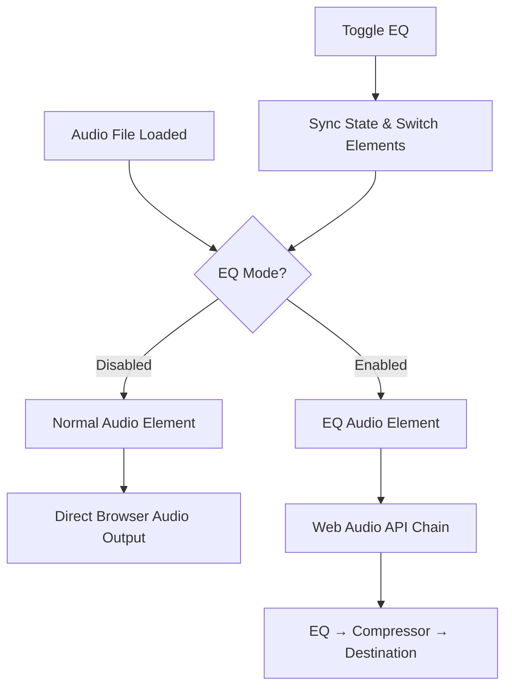
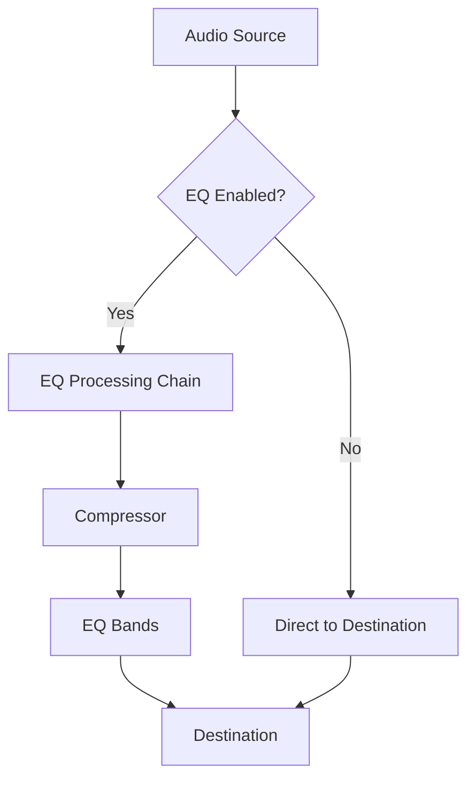
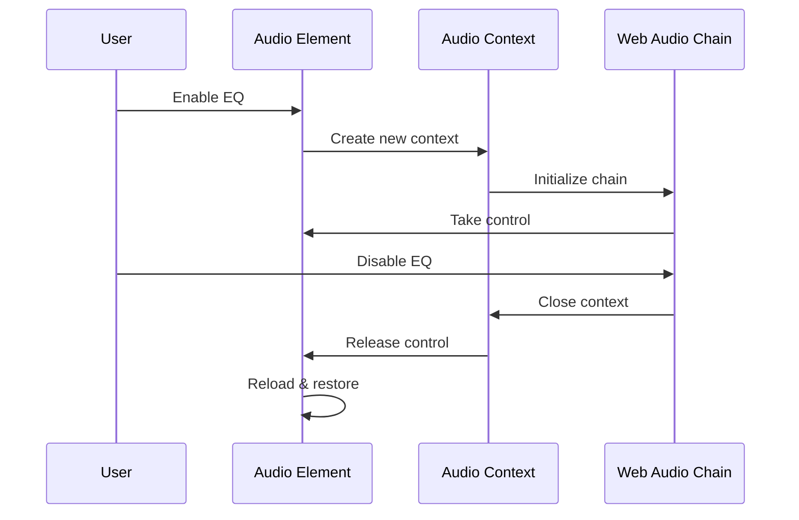

# Audio EQ Separation of Concerns Architecture

This document outlines the analysis and proposed solutions for creating proper separation between default audio playback and EQ processing in the Live EQ component.

## Root Cause Analysis

The primary issue is a lack of proper separation between audio playback modes, leading to inconsistent behavior when toggling EQ processing.

1. **Mixed Audio Responsibilities**: The current implementation tries to use the same audio element for both normal playback and Web Audio API processing, creating conflicts when switching between modes.

2. **MediaElementAudioSource Hijacking**: Once `createMediaElementAudioSource()` is called, the original `<audio>` element becomes muted and can only output through the Web Audio API chain. When we try to "disable" EQ by closing the AudioContext, we break the audio entirely.

3. **State Inconsistency**: The audio state (playing/paused/currentTime) is not properly synchronized when transitioning between playback modes, causing audio to disappear or restart unexpectedly.

4. **No Fallback Mechanism**: When EQ processing fails or is disabled, there's no reliable fallback to restore normal audio playback.

---

## Implementation Options

Here are three potential solutions to create proper separation of concerns.

### Option 1: Dual Audio Element Architecture (Recommended)

This option creates two separate audio elements - one for normal playback and one for EQ processing - with seamless switching between them.

**Logic:**
- Maintain two `<audio>` elements: `normalAudioRef` and `eqAudioRef`
- Only one is active at a time, with synchronized state
- EQ processing uses dedicated audio element with Web Audio API
- Normal playback uses standard HTML audio element
- Smooth transitions preserve playback state (time, playing status)



**Code Structure:**
```javascript
// Two separate audio elements
const normalAudioRef = useRef<HTMLAudioElement>(null);
const eqAudioRef = useRef<HTMLAudioElement>(null);

// State synchronization function
const syncAudioState = (from: HTMLAudioElement, to: HTMLAudioElement) => {
  to.currentTime = from.currentTime;
  to.volume = from.volume;
  if (!from.paused) to.play();
};

// Toggle between modes
const toggleEQMode = (enabled: boolean) => {
  if (enabled) {
    syncAudioState(normalAudioRef.current, eqAudioRef.current);
    initializeWebAudioChain(eqAudioRef.current);
  } else {
    cleanupWebAudioChain();
    syncAudioState(eqAudioRef.current, normalAudioRef.current);
  }
};
```

---

### Option 2: Single Element with Bypass Chain

This option uses one audio element but creates a Web Audio API chain that can be bypassed for normal playback.

**Logic:**
- Always use Web Audio API, but create a "bypass" mode
- When EQ is disabled, audio goes directly from source to destination
- When EQ is enabled, audio goes through processing chain
- No element switching, just audio routing changes



**Code Structure:**
- Create bypass/gain nodes for routing
- Connect/disconnect processing nodes based on EQ state
- Maintain single audio element throughout

---

### Option 3: Audio Context State Management

This option properly manages AudioContext lifecycle to avoid the hijacking issue.

**Logic:**
- Create and destroy AudioContext properly for each mode
- Implement proper cleanup and restoration
- Use audio element loading/unloading to reset state
- Handle browser audio policy correctly



---

## Detailed Implementation Plan (Option 1)

### Phase 1: Dual Audio Element Setup

1. **Create Two Audio References**:
   ```javascript
   const normalAudioRef = useRef<HTMLAudioElement>(null);
   const eqAudioRef = useRef<HTMLAudioElement>(null);
   const [activeAudioMode, setActiveAudioMode] = useState<'normal' | 'eq'>('normal');
   ```

2. **State Synchronization Utilities**:
   ```javascript
   const syncAudioState = useCallback((fromRef, toRef) => {
     if (!fromRef.current || !toRef.current) return;
     
     const from = fromRef.current;
     const to = toRef.current;
     
     // Sync playback state
     to.currentTime = from.currentTime;
     to.volume = from.volume;
     to.playbackRate = from.playbackRate;
     
     // Handle play state
     if (!from.paused) {
       to.play().catch(console.error);
     } else {
       to.pause();
     }
   }, []);
   ```

3. **Audio Mode Switching**:
   ```javascript
   const switchToEQMode = useCallback(async () => {
     if (activeAudioMode === 'eq') return;
     
     // Sync state from normal to EQ
     syncAudioState(normalAudioRef, eqAudioRef);
     
     // Pause normal audio
     normalAudioRef.current?.pause();
     
     // Initialize Web Audio chain
     await initializeEQProcessing(eqAudioRef.current);
     
     setActiveAudioMode('eq');
   }, [activeAudioMode, syncAudioState]);
   
   const switchToNormalMode = useCallback(() => {
     if (activeAudioMode === 'normal') return;
     
     // Sync state from EQ to normal
     syncAudioState(eqAudioRef, normalAudioRef);
     
     // Cleanup Web Audio
     cleanupEQProcessing();
     
     // Pause EQ audio
     eqAudioRef.current?.pause();
     
     setActiveAudioMode('normal');
   }, [activeAudioMode, syncAudioState]);
   ```

### Phase 2: Web Audio Chain Management

1. **Isolated EQ Processing**:
   ```javascript
   const initializeEQProcessing = useCallback(async (audioElement) => {
     if (!audioElement || audioContextRef.current) return;
     
     audioContextRef.current = new AudioContext();
     
     if (audioContextRef.current.state === 'suspended') {
       await audioContextRef.current.resume();
     }
     
     sourceRef.current = audioContextRef.current.createMediaElementSource(audioElement);
     
     // Create processing chain
     createEQChain();
     connectAudioChain();
   }, []);
   
   const cleanupEQProcessing = useCallback(() => {
     if (audioContextRef.current) {
       audioContextRef.current.close();
       audioContextRef.current = null;
       sourceRef.current = null;
       filtersRef.current = [];
       compressorRef.current = null;
     }
   }, []);
   ```

2. **Transport Control Abstraction**:
   ```javascript
   const getActiveAudioElement = useCallback(() => {
     return activeAudioMode === 'normal' 
       ? normalAudioRef.current 
       : eqAudioRef.current;
   }, [activeAudioMode]);
   
   const playAudio = useCallback(() => {
     const activeElement = getActiveAudioElement();
     if (activeElement) {
       activeElement.play().catch(console.error);
       setIsPlaying(true);
     }
   }, [getActiveAudioElement]);
   
   const pauseAudio = useCallback(() => {
     const activeElement = getActiveAudioElement();
     if (activeElement) {
       activeElement.pause();
       setIsPlaying(false);
     }
   }, [getActiveAudioElement]);
   ```

### Phase 3: UI Integration

1. **Render Both Audio Elements**:
   ```jsx
   {/* Normal playback audio element */}
   <audio
     ref={normalAudioRef}
     src={audioFile}
     className="hidden"
     onTimeUpdate={() => activeAudioMode === 'normal' && setCurrentTime(normalAudioRef.current?.currentTime || 0)}
     onPlay={() => activeAudioMode === 'normal' && setIsPlaying(true)}
     onPause={() => activeAudioMode === 'normal' && setIsPlaying(false)}
   />
   
   {/* EQ processing audio element */}
   <audio
     ref={eqAudioRef}
     src={audioFile}
     className="hidden"
     onTimeUpdate={() => activeAudioMode === 'eq' && setCurrentTime(eqAudioRef.current?.currentTime || 0)}
     onPlay={() => activeAudioMode === 'eq' && setIsPlaying(true)}
     onPause={() => activeAudioMode === 'eq' && setIsPlaying(false)}
   />
   ```

2. **EQ Toggle Controls**:
   ```jsx
   <button
     onClick={activeAudioMode === 'normal' ? switchToEQMode : switchToNormalMode}
     className={`px-4 py-2 rounded transition-colors ${
       activeAudioMode === 'eq' 
         ? 'bg-red-600 hover:bg-red-500 text-white' 
         : 'bg-blue-600 hover:bg-blue-500 text-white'
     }`}
   >
     {activeAudioMode === 'eq' ? 'Disable Live EQ' : 'Enable Live EQ'}
   </button>
   ```

### Phase 4: Project Loading Integration

1. **Project Audio Loading**:
   ```javascript
   useEffect(() => {
     if (projectData?.originalAudioUrl) {
       setAudioFile(projectData.originalAudioUrl);
       // Always start in normal mode for loaded projects
       setActiveAudioMode('normal');
       setIsLiveEQEnabled(false);
     }
   }, [projectData]);
   ```

2. **Consistent State Reset**:
   ```javascript
   const resetAudioState = useCallback(() => {
     cleanupEQProcessing();
     setActiveAudioMode('normal');
     setIsLiveEQEnabled(false);
     setIsPlaying(false);
     setCurrentTime(0);
   }, [cleanupEQProcessing]);
   ```

---

## Expected Benefits

1. **✅ Consistent Toggle Behavior**: EQ can be enabled/disabled reliably without losing audio
2. **✅ Proper Separation**: Normal playback and EQ processing are completely isolated
3. **✅ Seamless Transitions**: State is preserved when switching between modes
4. **✅ Predictable Defaults**: Always starts in normal mode, EQ is opt-in
5. **✅ Robust Error Handling**: Fallback to normal mode if EQ processing fails

## Testing Scenarios

### New Project Flow:
1. Upload audio → Normal playback available ✅
2. Enable EQ → Seamless switch to EQ processing ✅
3. Disable EQ → Return to normal playback ✅
4. Repeat toggle → Consistent behavior ✅

### Existing Project Flow:
1. Load project → Audio loads in normal mode ✅
2. Enable EQ → Switch to EQ processing with project settings ✅
3. Disable EQ → Return to normal playback ✅
4. Save changes → Settings preserved ✅

### Edge Cases:
- Browser audio policy restrictions → Graceful degradation
- AudioContext creation failures → Fallback to normal mode
- Network issues during loading → Error handling with retry
- Rapid toggle operations → Debounced state management

This architecture ensures reliable, predictable behavior for all audio playback and EQ processing scenarios.
