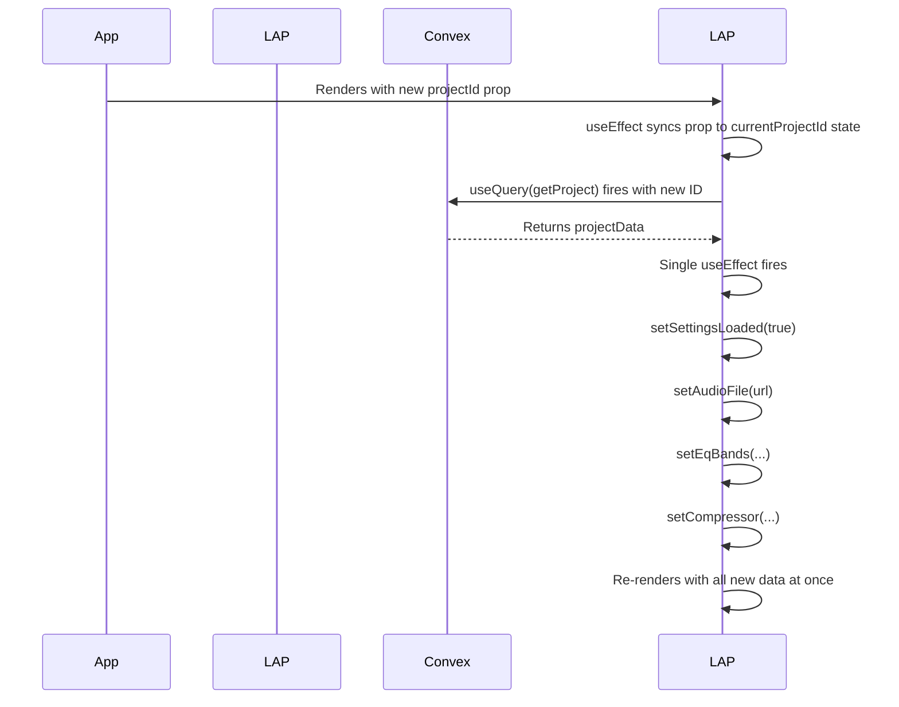

# Plan for Fixing Audio Auto-Loading

This document outlines the analysis and proposed solutions for the audio auto-loading issue in the Live EQ component.

## Root Cause Analysis

The primary issue appears to be a combination of component state initialization and the timing of `useEffect` hooks.

1.  **State Initialization vs. Prop Updates**: The component initializes its internal state `currentProjectId` from the `projectId` prop using `useState(projectId)`. This only runs on the initial mount. While the current navigation in `App.tsx` unmounts and remounts the component (making this work), it's a fragile pattern. If navigation logic changed, it would break. A more robust pattern is to use an effect to synchronize the prop with the state.

2.  **Complex `useEffect` Dependencies**: The audio loading effect `useEffect(..., [projectData?.originalAudioUrl, audioFile])` includes the state it sets (`audioFile`) in its dependency array. This can create confusing execution flows and is often a sign of an effect that is trying to do too much. The effect should simply react to the incoming data (`projectData`) and synchronize the component's state accordingly.

3.  **Race Condition**: When the `projectData` arrives from the `useQuery` hook, it triggers a re-render. The `useEffect` for audio loading then fires and calls `setAudioFile`. This triggers *another* re-render. While React batches these, the `<audio>` element's `src` attribute is only set on the final render. This multi-step process can be fragile. The audio should be loaded as a direct consequence of the project data being available.

---

## Implementation Options

Here are three potential solutions to fix the audio auto-loading issue.

### Option 1: Simplify the Audio Loading Effect (Minimal Change)

This option makes the smallest possible change to fix the immediate problem. It simplifies the `useEffect` hook to remove the complex condition and directly react to changes in the `projectData`.

**Logic:**
- The `useEffect` will only depend on `projectData`.
- When `projectData` is available, it will set the `audioFile` state to the `originalAudioUrl`.
- This ensures a direct, one-way data flow from the query result to the audio player's state.

```mermaid
graph TD
    A[useQuery(getProject) returns projectData] --> B{useEffect fires};
    B --> C{projectData.originalAudioUrl exists?};
    C -- Yes --> D[setAudioFile(url)];
    C -- No --> E[Do nothing];
    D --> F[Component re-renders, audio src is set];
```

**Code Changes:**
- Modify the audio loading `useEffect` in `src/components/LiveAudioProcessor.tsx`.

---

### Option 2: Sync `projectId` Prop to State and Refactor Loading (Recommended)

This option is more robust. It fixes the potential stale state issue with `projectId` and consolidates the data loading logic into a single, clearer `useEffect` hook that handles all data from `projectData`.

**Logic:**
- Add a `useEffect` to explicitly sync the incoming `projectId` prop to the component's internal `currentProjectId` state. This makes the component resilient to future changes in navigation.
- Combine the settings and audio loading into one `useEffect` that depends only on `projectData`. This ensures all project-related state is updated in a single, predictable render cycle after the data is fetched.



**Code Changes:**
- Add a new `useEffect` for `projectId` in `src/components/LiveAudioProcessor.tsx`.
- Merge the two `useEffect` hooks that depend on `projectData`.

---

### Option 3: Control the Audio Element Directly (Advanced)

This option takes a more imperative approach by using a `ref` to the `<audio>` element and manually controlling its `src` and `load()` methods. This gives us the most control and can solve tricky race conditions where the browser doesn't automatically pick up a changed `src` attribute.

**Logic:**
- The `useEffect` will still react to `projectData`.
- Instead of just calling `setAudioFile`, it will also get the `audioRef.current` DOM element.
- It will directly set `audioRef.current.src = projectData.originalAudioUrl`.
- It will then explicitly call `audioRef.current.load()` to force the browser to start loading the new audio source.
- The `audioFile` state is still used to ensure the `<audio>` element is rendered in the first place.

```mermaid
graph TD
    A[useQuery returns projectData] --> B{useEffect fires};
    B --> C{URL is different from audioRef.current.src?};
    C -- Yes --> D[setAudioFile(url)];
    D --> E[Get audioRef.current];
    E --> F[Set audioRef.current.src = url];
    F --> G[Call audioRef.current.load()];
    C -- No --> H[Do nothing];
```

**Code Changes:**
- Modify the audio loading `useEffect` in `src/components/LiveAudioProcessor.tsx` to use the `audioRef`.

---

### My Recommendation

I recommend **Option 2**. It addresses the underlying potential for stale state while also simplifying the data loading logic into a single, cohesive block. This improves the component's robustness and makes it easier to understand and maintain in the future. It follows React's declarative patterns more closely than Option 3.